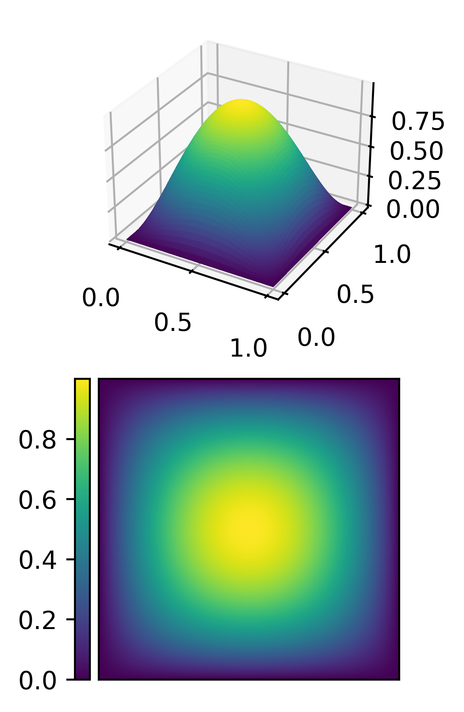

### Description
Basic FEM implementation to better understand how things work.
The conceptual design and nameing conventions are loosely based on the
mathmatical framework of __Finite Element Exterior Calculus__.


To solve an exemplarotry PDE, run `python -m pdes.poisson` from top level directory.

The scripts in `/scripts/` were used to generate the plots in the report.


### Fundamentals
To solve a custom PDE, a finite element function space is needed.
Such a space is based on a mesh and a base element.
It might look like this:
```
m = SimplexMesh.Create_2d_unit_square_structured(n)
fs = FEFunctionSpace(m, PElement(d, m.element))
```

To generate boundary conditions, a function space on the boundary of this space can be generated:
```
db_fs = FEFunctionSpace(m.boundary_mesh, PElement(d, m.element.lower_element))
```

To now solve the poisson equation on this function space:  
∆u = f in Ω  
u = s on ∂Ω  
```
u = poisson(fs,
            f,
            (s, db_fs))
```
Where f and s are regular python functions representing the force and boundary function.
The function `poisson` creates the Laplacian and solves the system, returning an object of type `FEFunction`.
This could be further manipulated or plotted.


### TODO
- Neumann Boundary conditions don't work on this implementation of the poisson equation for Lagrange elements of order higher than 2.
- Other Element Types
